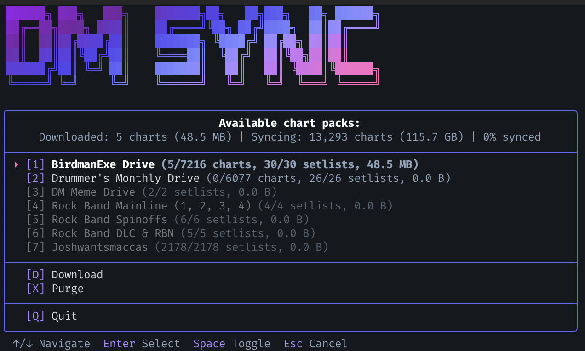

# DM Chart Sync

Download Clone Hero charts from Google Drive. No setup required.



## Usage

### Windows
Download `dm-sync.exe` from [Releases](../../releases) and run it.

### macOS
Download `dm-sync-macos` from [Releases](../../releases), then:
```bash
xattr -d com.apple.quarantine dm-sync-macos
chmod +x dm-sync-macos
./dm-sync-macos
```

### From Source
```bash
pip install -r requirements.txt
python sync.py
```

## Features

- **Smart sync** - only downloads new/changed files
- **Parallel downloads** with auto-retry on rate limits
- **Setlist filtering** - enable/disable individual setlists per drive
- **Custom folders** - add your own Google Drive folders
- **Optional sign-in** - get your own download quota for faster syncs
- **Archive support** - auto-extracts .7z/.zip archives with optional video removal
- **Purge** - clean up disabled content to free disk space

## For Admins

### Manifest Updates

The manifest auto-updates daily via GitHub Actions.

**Manual trigger:** Actions → "Update Manifest" → Run workflow

**Setup:**
1. Create OAuth credentials at [Google Cloud Console](https://console.cloud.google.com/apis/credentials)
2. Run `python manifest_gen.py` locally to generate `token.json`
3. Add GitHub Secrets: `GOOGLE_CREDENTIALS`, `GOOGLE_TOKEN`, `GOOGLE_API_KEY`

### Building

Builds are automatic via GitHub Actions on push to main.

Manual build:
```bash
pip install pyinstaller
pyinstaller --onefile --name dm-sync sync.py
```
