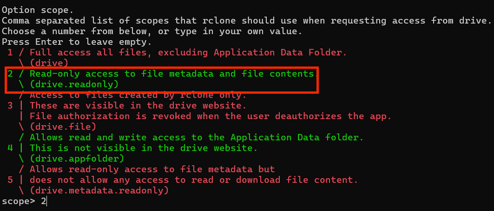

# Syncing Songs with Rclone
 
Rclone is a command line tool used to sync files on your computer with cloud storage. This is useful because it allows members of **Drummer’s Monthly** to maintain a common and up-to-date song list without relying on the broken mess that is the Google Drive desktop app. Once set up, all you'll have to do is run the attached script anytime you want to update your songs. To set this up you'll need a Google account but paying for Google Drive is not necessary. 

## Setup

1. Add shortcuts to your Google Drive
   * In **My Drive**, create a folder and call it **CH Charts** (case sensitive)

   
   * For each drive you want to sync, go to them and click:
        1. Folder name at the top
        2. Organize
        3. Add Shortcut
        4. All Locations
        5. Arrow to the right of My Drive to (or double click)
        6. **CH Charts** (case sensitive)
        7. Add

    

    
    
    

#### Windows
2. Grab the latest version of [rclone](https://rclone.org/downloads/) and place `rclone.exe` into your wherever you store your local songs
3. Download rclone scripts from github by clicking the large green code button. Then place `config.bat` and `sync.bat` and place them in the same folder as the exe

4. Run config.bat and follow the interactive prompt instructions for `n) New remote`
* Name it **gdrive**
* Storage - **Google Drive** (note the number may differ from what is shown below)
* Scope - **Read-only access**
* For all other options use defaults
    

1. (Optional) If you want to use a different remote or local path, edit sync.bat
    * Default remote path is `"gdrive:CH Charts"` and local is `"%~dp0/Sync Charts"`
    * Change `CH Charts` or `Sync Charts` to `Path/To/Charts` as appropriate.
2. Run `sync.bat` and your song folder should populate 

   
#### MacOS
2. Download the MacOS scripts `config.sh` and `sync.sh` and place them wherever you store your local songs
3. Open `config.sh` with **Terminal.app** and follow the interactive prompt instructions for `n) New remote`
    * Name it **gdrive**
    * Storage - **Google Drive**
    * Scope - **Read-only access**
    * For all other options use defaults
4. (Optional) If you want to use a different remote or local path, edit sync.sh
    * Default remote path is `"gdrive:CH Charts"` and local is `"$(dirname "$0")/Sync Charts"`
    * Change `CH Charts` or `Sync Charts` to `Path/To/Charts` as appropriate
5. Open `sync.sh` with **Terminal.app** and your song folder should populate

**Tip**: You can set a bash script (.sh) to always open by default with **Terminal** by right clicking the file and clicking
* Get Info
* Open With dropdown
* Other... (at the bottom)
* Changing **Recommended Applications** to **All Applications**
* Utilities/Terminal.app
  
Now when you double click it'll automatically run the script.

### To sync songs again, just run the sync script

**Important**: Anything inside this folder not on the remote drive will be deleted, so make sure it is a folder inside the folder containing this script or that will be deleted too.

**But what's happening?** The sync script checks your local directory for every file expected on the remote drive. If it sees something is missing or isn't exactly the same file, it'll download it. Similarly, if it sees a file that isn't on the remote drive, it will be removed so again be careful to set your paths correctly (or leave them default). 

## FAQ 

#### WhY nOt WoRk?!
Did you name things correctly? 99% of issues folks run into are because folders are **case sensitive**!

#### What's wrong with the Google Drive desktop app?
The drive app has lots of issues. Sometimes files download (or update to become) corrupted. The drive can sometimes refuse to download new files for no reason. If you don't pay for the drive, you cannot sync specific folders selectively. The drive is often incredibly slow at downloading out of the blue. You're not able to change where the actual files 

#### All I see is DEBUG : Pacer : reducing sleep to xxx? 
This often happens at the beginning of a sync and just means Google Drive is being slow to respond. Leave the script alone for a couple minutes and it should start syncing properly. 

#### What does %~dp0 mean? 
This basically means the folder this script is in and should be equivalent to . for those familiar with Unix. 

#### How can I speed things up? 
Once downloaded, syncing shouldn't take longer than 10-20 minutes but if it does, here are a couple things to try.
1. Trying different values for --checkers and --transfers, higher is sometimes faster if you have decent hardware, or lower if you don't
2. Using a custom client_id for Google Drive, see here for instructions (Don't do this unless you're comfortable with lite cs)

#### Rclone isn't syncing properly? How do I fix it?
In rare cases where rclone is totally mucked up and missing downloads, or deleting folders it shouldn't, one option is to set --checkers to 1 and remove --transfers 16 entirely. This forces a sequential sync and seems to be more stable for lower tier CPUs, but will also take longer to complete.
